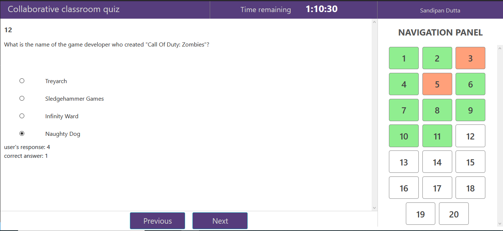

# Quiz interface using Vue.js for Collaborative classroom project


</br></br>

:star: Development in progress

### This single page application(SPA) quiz interface is designed to fetch a set of MCQs from the server [Collaborative classroom API](https://github.com/SandipanDGit/Collaborative-classroom-API) and run the quiz with a countdown timer. 

</br>

This application makes use of vue.js and vuex for state management. Bootstrap is used for styling.

</br>

As of now, it is not hooked with collaborative classroom APIs. It fetches a set of 20 random but interesting questions from [Trivia API](https://opentdb.com/api_config.php). There is no authentication as of now, anybody can download and enjoy the quiz with variety of interesting questions. 

</br>

## Salient features

:point_right: Countdown timer </br>
:point_right: Question navigation panel </br>
:point_right: Visual representation for answered, unanswered and untouched questions</br>
:point_right: Auto saves user responses </br>

</br>

## Here is a snapshot of the UI



</br></br>


## Project setup

### System requirements: 
 + Node & npm
   
After cloning the repo, run the following :point_down:

### Install all the dependencies
```
npm install
```

### Compiles and hot-reloads for development
```
npm run serve
```
</br>
Development in progress, all features may not be functioning right now.

### Feel free to crack open an issue though, or drop general feedback.

